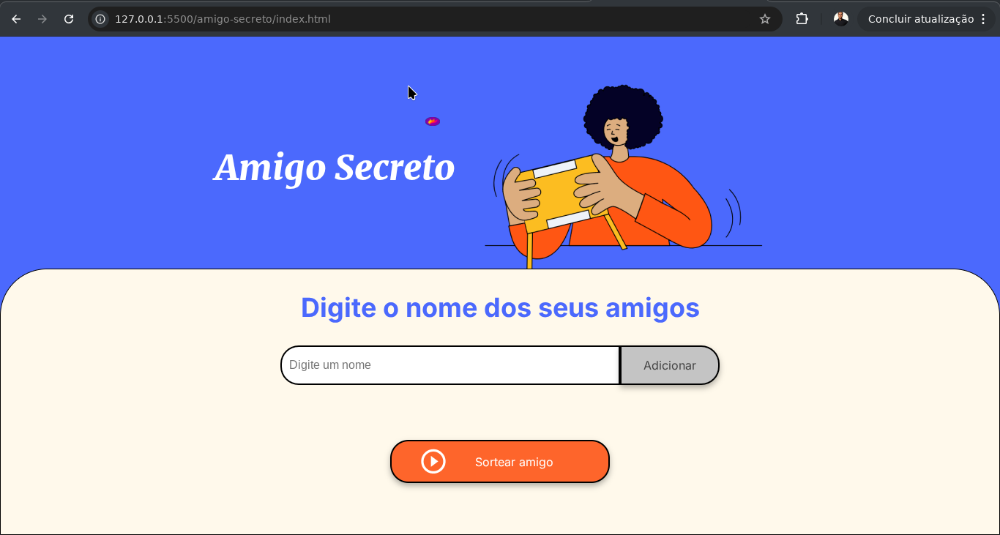

# Sorteio do Amigo secreto

## Este projeto é parte da formação iniciante em lógica de programação da #AluraLatam.
## Foi realizado como parte da formação em Backend e Data Science do programa Oracle Next Education.

### Este desafio consiste em atribuir o código Java Script a uma página Html com os seguintes objetivos:

    - Popular uma lista com participantes em um evento de Amigo Secreto;
    - Exibir a lista de participantes na página HTML;
    - Selecionar um participante da lista aleátoriamente;
    - Exibir o participante selecionado na página HTML;

### O desafio proporciona o aprendizado dos seguintes conceitos:

    - Criar, popular e acessar elementos em uma array;
    - Utilizar o Dom para acessar elementos HTML com Java Script;
    - Criar e inserir elementos em uma página HTML com Java Script;
    - Gerar numeros aleatórios com as funções randon() e floor() da biblioteca padrão do Java Script,Math;
    - Criar funções e váriaveis, assim como compreender o seu escopo;
    - Utilizar a estrutura de repetição for;
    - Utilizar o git e o github para compartilhar projetos;

## Snapshot
### Você pode ver a página em funcionamento no link <a href="https://taidson-so.github.io/Alura/amigo-secreto/">amigo secreto</a>

